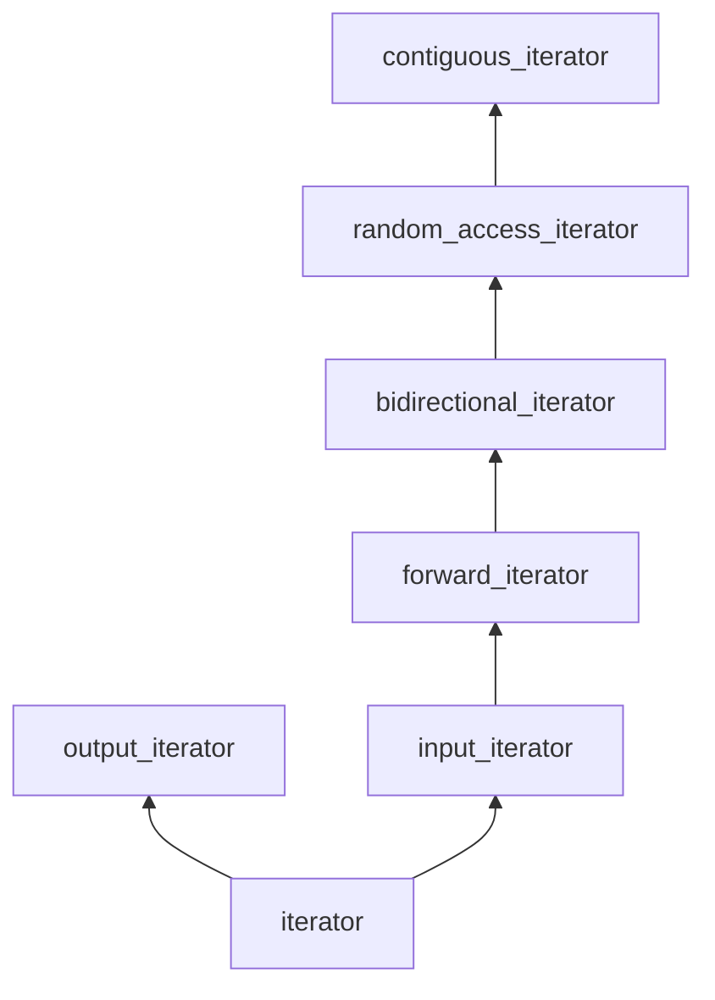

- 迭代器备忘录

##### STL每种容器对应的迭代器

| 容器                                  | 迭代器         |
| ------------------------------------- | -------------- |
| vector deque                          | 随机访问迭代器 |
| stack queue priority _queue           | 无             |
| list (multi)set/map                   | 双向迭代器     |
| Unordered_(multi)set/map forward_list | 前向迭代器     |

##### 什么是迭代器？

迭代器是一种很通用的概念，并不是一个特定的类型。他实际上是一组对类型的要求。

它的最基本要求就是从一个端点出发，下一步，下一步地到达另一个端点。按照一般的中文习惯，也许“遍历”是比“迭代”更好的用词。我们可以遍历一个字符串的字符，遍历一个文件的内容，遍历目录里的所有文件，等等。这些都可以用迭代器来表达。

输入迭代器不要求对同一迭代器可以多次使用*运算符，也不要求可以保存迭代器来重新遍历对象，换句话说，只要求可以单次访问。如果取消这些限制，允许多次访问的话，那迭代器同时满足了前向迭代器（forward iterator）。

一个前向迭代器的类型，如果同时支持--（前置以及后置），回到前一个对象，拿他就是个双向迭代器(bidirectional iterator)。也就是说，可以正向遍历，也可以反向遍历。

一个双向迭代器，如果额外支持在整数类型上的+,-,+=,-=,跳跃式地移动迭代器；支持[]，数组式的下标访问；支持迭代器的大小比较（之前只要求相等比较）；那它就是个随机访问迭代器(random access iterator)。

一个随机访问迭代器i和一个整数n，在*i可解引用且i+n是合法迭代器的前提下，如果额外还满足

```c++
*(addressof(*i)+n)
```

等价于

```c++
*（i+n）
```

即保证迭代器指向的对象在内存里是连续存放的，那它就是一个连续迭代器(contiguous iterator)。

以上这些迭代器只考虑了读取。如果一个类型像输入迭代器，但*i只能最为左值来写而不能读，那它就是个输出迭代器(output iterator)。

而比输入迭代器和输出迭代器更底层的概念，就是迭代器了。基本要求是：

- 对象可以被拷贝构造，拷贝赋值和析构
- 对象支持*运算符（取内容）
- 对象支持前置++运算符



各迭代器特点：

- 迭代器：支持++和*
- 输出迭代器：用*输出
- 输入迭代器：用*读取
- 前向迭代器：可反复读取
- 双向迭代器：支持--
- 随机访问迭代器：支持跳跃和比较
- 连续迭代器：存储连续

迭代器通常是对象。但需要注意的是，指针可以满足上面所有迭代器的要求，因而也是迭代器。本来迭代器就是根据指针的特性，对其进行抽象的结果。事实上，vector的迭代器，在很多实现里就直接是使用指针的。

##### 常用迭代器

最常用的迭代器就是容器的iterator类型了。以顺序容器为例，它们都定义了嵌套的iterator类型和const_iterator类型。一般而言，iterator可写入，const_iterator类型不可写入，但这些迭代器都被定义为输入迭代器或其派生类型：

- vector::iterator和array::iterator可以满足到连续迭代器。
- deque::iterator可以满足到随机访问迭代器（它的内存只有部分连续）
- list::iterator可以满足到双向迭代器（链表不能快速跳转）
- forward_list::iterator可以满足到前向迭代器（单向链表不能反向遍历）

很常用的一个输出迭代器back_inserter返回的类型back_inserter_iterator了；使用它我们可以很方便地在容器的尾部进行插入操作。另外一个很常见的输出迭代器是ostream_iterator，方便我们把容器内容“拷贝”到一个输出流。

##### 使用输入行迭代器

功能：把一个输入流(istream)的内容一行行读进来。

```c++
for(const string &line:istream_line_reader(is))
{
  cout<<line<<endl;
}
```

基于范围的for循环这个语法，对提高代码的可读性真的非常重要。如果不用这个语法糖，简洁性的优势就小多了。

等价的普通for循环的样子：

```c++
{
  auto && r = istream_line_reader(is);
  auto it = r.begin();
  auto end = r.end();
  for(;it != end;++i)
  {
    const string &line = *it;
    cout<<line<<endl;
  }
}
```

这段程序：

- 获取冒号后边的范围表达式的结果，并隐式产生一个引用，在整个循环期间都有效。注意根据生命期延长规则，表达式结果如果是临时对象的话，这个对象要在循环结束后才被销毁
- 自动生成遍历这个范围的迭代器
- 循环内自动生成根据冒号左边的声明和*it来进行初始化的语句
- 完全正常的循环体

生成迭代器这一步有可能是——但不一定是——调用r的begin和end成员函数。具体规则是：

- 对于c数组（必须是没有退化为指针的情况下），编译器会自动生成指向数组头尾的指针（相对于自动应用可用于数组的std::begin和std::end函数）
- 对于有begin和end成员的对象，编译器会自动调用起begin和end成员函数
- 否则，编译器会尝试在r对象所在的命名空间寻找可以用于r的begin和end函数，并调用begin(r)和end(r);找不到的话则失败报错。

##### 定义输入行迭代器

c++里有些固定的类型要求规范。对于一个迭代器，我们需要定义下面的类型：

```c++
class istream_line_reader
{
private:
    /* data */
public:
    istream_line_reader(/* args */);
    ~istream_line_reader();
    class iterator
    {
    //实现input iterator
    private:
        /* data */
    public:
    typedef std::ptrdiff_t difference_type;
    typedef std::string value_type;
    typedef const value_type*pointer;
    typedef const value_type&reference;
    typedef std::input_iterator_tag iterator_category;
    };   
};
```

仿照一般的容器，我们把迭代器定义为istream_line_reader的嵌套类。它里面的这五个类型是必须定义的。其中：

- difference_type是代表迭代器之间距离的类型，定义为ptrdiff_t只是种标准做法（指针间差值的类型），对这个类型没什么特别作用。
- value_type是迭代器指向的对象的值的类型，我们使用string，表示迭代器指向的是字符串。
- pointer是迭代器指向的对象的指针类型，这里定义为value_type的常指针
- 类似的，reference是value_type的常引用
- Iterator_category被定义为input_iterator_tag，标识这个迭代器的类型是input_iterator（输入迭代器）

作为一个只能读一次的输入迭代器，因此没有前向迭代器或其他衍生迭代器：应该让 * 负责读取还是++负责读取。我们这里采用常见，并且也较为简单的做法，让++负责读取，* 负责返回读取的内容。这样的话，这个iterator类需要有一个数据成员指向输入流，一个数据成员来存放读取的结果。类的基本成员函数和数据成员如下：

```c++
class istream_line_reader
{
private:
    /* data */

public:
    istream_line_reader(/* args */);
    ~istream_line_reader();
    class iterator
    {
    private:
        /* data */
        std::istream *stream_;
        std::string line_;
    public:
        typedef std::ptrdiff_t difference_type;
        typedef std::string value_type;
        typedef const value_type*pointer;
        typedef const value_type&reference;
        typedef std::input_iterator_tag iterator_category;
        iterator() noexcept
        : stream_(nullptr) {}
        explicit iterator(std::istream& is)
        : stream_(&is)
        {
            ++*this;
        }
        reference operator*() const noexcept
        {
            return line_;
        }
        pointer operator->() const noexcept
        {
            return &line_;
        }
        iterator& operator++()
        {
            getline(*stream_, line_);
            if (!*stream_) 
            {
                stream_ = nullptr;
            }
            return *this;
        }
        iterator operator++(int)
        {
            iterator temp(*this);
            ++*this;
            return temp;
        }
    };    
};

istream_line_reader::istream_line_reader(/* args */)
{
}

istream_line_reader::~istream_line_reader()
{
}

```

我们定义了默认构造函数，将stream_清空。相应的，在带参数的构造函数里，我们根据传入的输入流来设置stream _ .我们也定义了 * 和->运算符来取得迭代器指向的文本行的引用和指针，并用++来读取输入流的内容（后置++则以惯常方式使用前置++和拷贝构造来实现）。唯一“特别”点的地方，是我们在构造函数里调用了++，确保在构造后调用 * 运算符时可以读取内容，符合日常先使用 * ，再使用++的习惯。一旦文件读取到尾部（或出错），则steam _被清空，回到默认构造的情况。

对于迭代器之间的比较，我们则主要考虑文件有没有读到尾部的情况，简单定义为：

```c++
bool operator==(const iterator &rhs)
  const noexcept
{
  return stream_ == rhs.stream_;
}
bool operator!= (const iterator &rhs)
  const noexcept
{
  return !operator==(rhs);
}
```

istream_line_reader的完整定义：

```c++
class istream_line_reader
{
private:
    /* data */
    std::istream *stream_;

public:
    istream_line_reader(/* args */)noexcept;
    explicit istream_line_reader(std::istream &is)noexcept;
    ~istream_line_reader();
    class iterator
    {
    private:
        /* data */
        std::istream *stream_;
        std::string line_;
    public:
        typedef std::ptrdiff_t difference_type;
        typedef std::string value_type;
        typedef const value_type*pointer;
        typedef const value_type&reference;
        typedef std::input_iterator_tag iterator_category;
        iterator() noexcept
        : stream_(nullptr) {}
        explicit iterator(std::istream& is)
        : stream_(&is)
        {
            ++*this;
        }
        reference operator*() const noexcept
        {
            return line_;
        }
        pointer operator->() const noexcept
        {
            return &line_;
        }
        iterator& operator++()
        {
            getline(*stream_, line_);
            return *this;
        }
        iterator operator++(int)
        {
            iterator temp(*this);
            ++*this;
            return temp;
        }
        bool operator==(const iterator &rhs)
        const noexcept
        {
            return stream_ == rhs.stream_;
        }
        bool operator!= (const iterator &rhs)
        const noexcept
        {
            return !operator==(rhs);
        }
    };
    iterator begin()
    {
        return iterator(*stream_);
    }
    iterator end()const noexcept
    {
        return iterator();
    }   
};
istream_line_reader::istream_line_reader(/* args */)noexcept
{
    stream_ = nullptr;
}
istream_line_reader::istream_line_reader(std::istream &is)noexcept
{
    stream_ = &is;
}
istream_line_reader::~istream_line_reader()
{
}
```

如上，构造函数只是简单地把输入流的指针赋给stream_成员变量。begin()成员函数负责构造一个真正有意义的迭代器。end()成员函数则只是返回一个默认构造的迭代器而已。

以上就是一个完整的基于输入流的行迭代器。