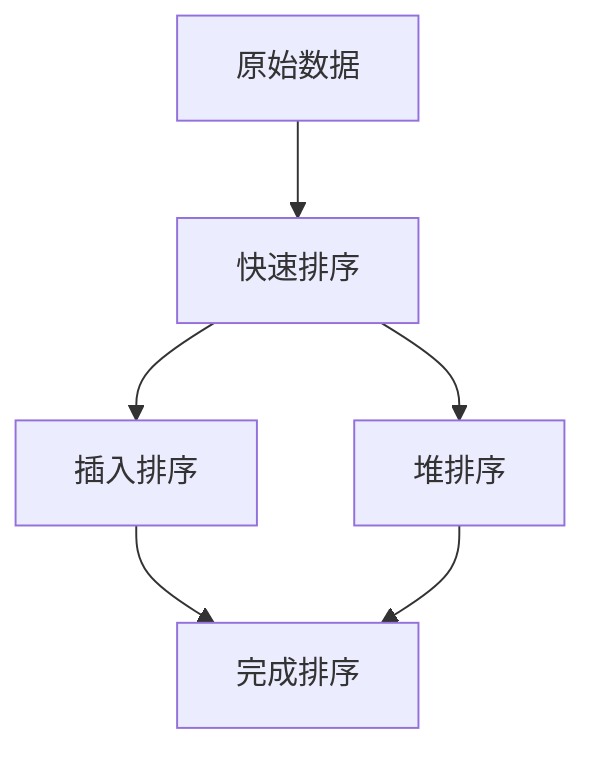

#### Stl sort实现

并非所有容器都使用sort算法实现

那么哪些stl容器需要用到sort算法？

- 首先，关系型容器（树）拥有自动排序功能，因为底层采用红黑树（RB-Tree），所以不需要用到sort算法
- 其次，序列式容器中的stack，queue，priority- queue都有特定的出入口，不允许用户对元素排序
- 剩下的vector，deque（与vector不同的是，其首尾都开放，因此可以在首尾进行快速插入和删除），适用sort算法

实现stl的sort算法：

数据量大时采用quick sort快排算法，分段归并排序。一旦分段后的数据量小于某个门槛，为避免快排的递归调用带来过大的额外负荷，就改用insertion sort插入排序。如果递归层数过深，还会改用heap sort堆排序。

